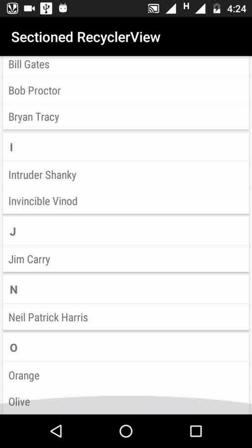

# Sectioned-RecyclerView
Easy implementation of RecyclerView with headers and items

[](https://jitpack.io/#IntruderShanky/Sectioned-RecyclerView)
[](http://android-arsenal.com/details/1/4495)
[](https://android-arsenal.com/api?level=11)

[Demo App - IS Library](https://play.google.com/store/apps/details?id=com.intrusoft.islibrarydemo)

<a href='https://play.google.com/store/apps/details?id=com.intrusoft.islibrarydemo&utm_source=global_co&utm_small=prtnr&utm_content=Mar2515&utm_campaign=PartBadge&pcampaignid=MKT-Other-global-all-co-prtnr-py-PartBadge-Mar2515-1'></a>

### Demo


### Usage
##### Step 1. Add the JitPack repository to your build file
###### Add it in your root build.gradle at the end of repositories:
```groovy
allprojects {
   repositories {
	...
	maven { url "https://jitpack.io" }
   }
}
```
##### Step 2. Add the dependency
```groovy
dependencies {
   compile 'com.github.IntruderShanky:Sectioned-RecyclerView:2.1.1'
}
```
### Implementation
There are very easy and simple steps to implement.
##### Step 1. Add RecyclerView in layout file:
```xml
<android.support.v7.widget.RecyclerView
   android:id="@+id/recycler_view"
   android:layout_width="match_parent"
   android:layout_height="wrap_content" />
```
##### Step 2. Create another layout file for Section Header:
```xml
<?xml version="1.0" encoding="utf-8"?>
<LinearLayout xmlns:android="http://schemas.android.com/apk/res/android"
    android:layout_width="match_parent"
    android:layout_height="match_parent"
    android:paddingTop="26dp"
    android:paddingLeft="16dp"
    android:paddingRight="16dp"
    android:orientation="vertical">

    <TextView
        android:id="@+id/section"
        android:layout_width="match_parent"
        android:layout_height="wrap_content"
        android:text="16sp"
        android:textSize="16sp"
        android:textStyle="bold"/>
    <View
        android:layout_width="match_parent"
        android:layout_height="1dp"
        android:layout_marginTop="5dp"
        android:background="#88424242"/>
</LinearLayout>
```

##### Step 3. Create another layout file for Section Child:
```xml
<?xml version="1.0" encoding="utf-8"?>
<LinearLayout xmlns:android="http://schemas.android.com/apk/res/android"
    android:layout_width="match_parent"
    android:layout_height="match_parent"
    android:paddingLeft="8dp"
    android:orientation="vertical">

    <TextView
        android:id="@+id/child"
        android:layout_width="match_parent"
        android:layout_height="wrap_content"
        android:textSize="16sp"
        android:text="mc sjcnscdj "
        android:padding="8dp"
        android:fontFamily="sans-serif-condensed"/>

</LinearLayout>
```

##### Step 4. Create a class for Section Child and named it. Here "Child.java"
```java
public class Child {

    String name;

    public Child(String name) {
        this.name = name;
    }

    public String getName() {
        return name;
    }
}
```

##### Step 5. Create a class for Section Header and implement it with Section. Here "Section.java"
```java
public class SectionHeader implements Section<Child> {

    List<Child> childList;
    String sectionText;

    public SectionHeader(List<Child> childList, String sectionText) {
        this.childList = childList;
        this.sectionText = sectionText;
    }

    @Override
    public List<Child> getChildItems() {
        return childList;
    }

    public String getSectionText() {
        return sectionText;
    }
}
```

##### Step 6. Create a two ViewHolder classes to hold the views of section and child.
```java
public class SectionViewHolder extends RecyclerView.ViewHolder {

    TextView name;
    public SectionViewHolder(View itemView) {
        super(itemView);
         name = (TextView) itemView.findViewById(R.id.section);
    }
}
```

```java
public class ChildViewHolder extends RecyclerView.ViewHolder {

    TextView name;
    public ChildViewHolder(View itemView) {
        super(itemView);
        name = (TextView) itemView.findViewById(R.id.child);
    }
}
```

##### Step 7. Create a Adater for RecyclerView. Here "AdapterSectionRecycler.java"
```java
public class AdapterSectionRecycler extends SectionRecyclerViewAdapter<Section, Child, SectionViewHolder, ChildViewHolder> {

    Context context;

    public AdapterSectionRecycler(Context context, List<Section> sectionItemList) {
        super(context, sectionItemList);
        this.context = context;
    }

    @Override
    public SectionViewHolder onCreateSectionViewHolder(ViewGroup sectionViewGroup, int viewType) {
        View view = LayoutInflater.from(context).inflate(R.layout.section_item, sectionViewGroup, false);
        return new SectionViewHolder(view);
    }

    @Override
    public ChildViewHolder onCreateChildViewHolder(ViewGroup childViewGroup, int viewType) {
        View view = LayoutInflater.from(context).inflate(R.layout.item_layout, childViewGroup, false);
        return new ChildViewHolder(view);
    }

    @Override
    public void onBindSectionViewHolder(SectionViewHolder sectionViewHolder, int sectionPosition, Section section) {
        sectionViewHolder.name.setText(section.sectionText);
    }

    @Override
    public void onBindChildViewHolder(ChildViewHolder childViewHolder, int sectionPosition, int childPosition, Child child) {
        childViewHolder.name.setText(child.getName());
    }
}
```

##### Step 8. Here complete code of your Activity Class, Here "MainActivity.java"
```java
public class MainActivity extends AppCompatActivity {

    RecyclerView recyclerView;
    AdapterSectionRecycler adapterRecycler;

    @Override
    protected void onCreate(Bundle savedInstanceState) {
        super.onCreate(savedInstanceState);
        setContentView(R.layout.activity_main);

        //initialize RecyclerView
        recyclerView = (RecyclerView) findViewById(R.id.recycler_view);

        //setLayout Manager
        LinearLayoutManager linearLayoutManager = new LinearLayoutManager(this);
        recyclerView.setLayoutManager(linearLayoutManager);
        recyclerView.setHasFixedSize(true);

        //Create a List of Child DataModel
        List<Child> childList = new ArrayList<>();
        childList.add(new Child("April"));
        childList.add(new Child("Austin"));
        childList.add(new Child("Alex"));
        childList.add(new Child("Aakash"));

        //Create a List of Section DataModel implements Section
        List<Section> sections = new ArrayList<>();
        sections.add(new Section(childList, "A"));

        childList = new ArrayList<>();
        childList.add(new Child("Bill Gates"));
        childList.add(new Child("Bob Proctor"));
        childList.add(new Child("Bryan Tracy"));
        sections.add(new Section(childList, "B"));

        childList = new ArrayList<>();
        childList.add(new Child("Intruder Shanky"));
        childList.add(new Child("Invincible Vinod"));
        sections.add(new Section(childList, "I"));

        childList = new ArrayList<>();
        childList.add(new Child("Jim Carry"));
        sections.add(new Section(childList, "J"));

        childList = new ArrayList<>();
        childList.add(new Child("Neil Patrick Harris"));
        sections.add(new Section(childList, "N"));

        childList = new ArrayList<>();
        childList.add(new Child("Orange"));
        childList.add(new Child("Olive"));
        sections.add(new Section(childList, "O"));

        adapterRecycler = new AdapterSectionRecycler(this, sections);
        recyclerView.setAdapter(adapterRecycler);
    }
}
```


Data Change Methods
---------
```java
insertNewSection(Section)
insertNewSection(Section, int)
removeSection(int)
insertNewChild(Object, int)
insertNewChild(Object, int, int)
removeChild(int, int)

/* To notify the adapter for data change 
 * call notifyDataChanged(List) instead of 
 * notiftDatasetChanged()
 */ 
notifyDataChanged(List)
```

Licence
--------

```
Licensed under the Apache License, Version 2.0 (the "License");
you may not use this file except in compliance with the License.
You may obtain a copy of the License at

    http://www.apache.org/licenses/LICENSE-2.0

Unless required by applicable law or agreed to in writing, software
distributed under the License is distributed on an "AS IS" BASIS,
WITHOUT WARRANTIES OR CONDITIONS OF ANY KIND, either express or implied.
See the License for the specific language governing permissions and
limitations under the License.
```
